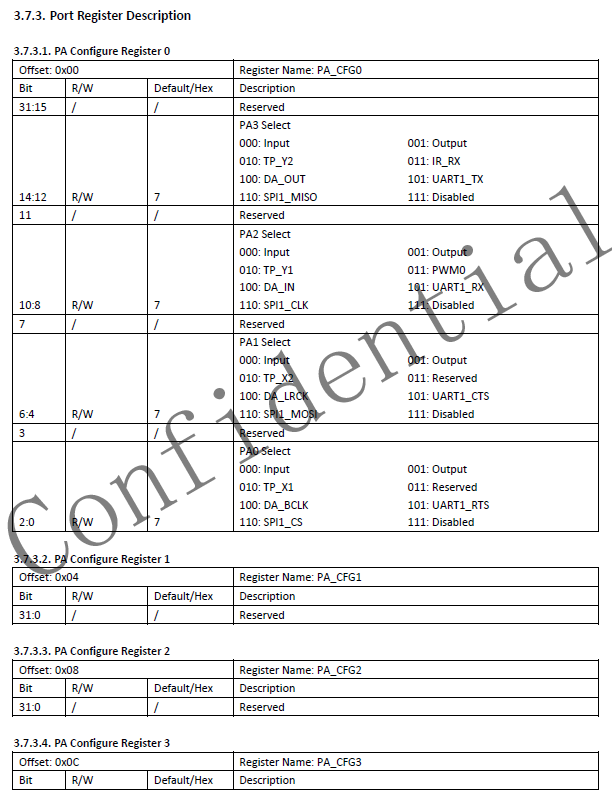
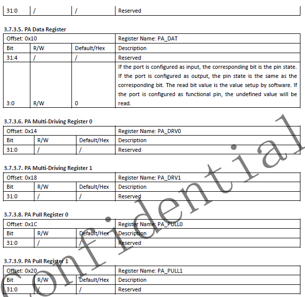
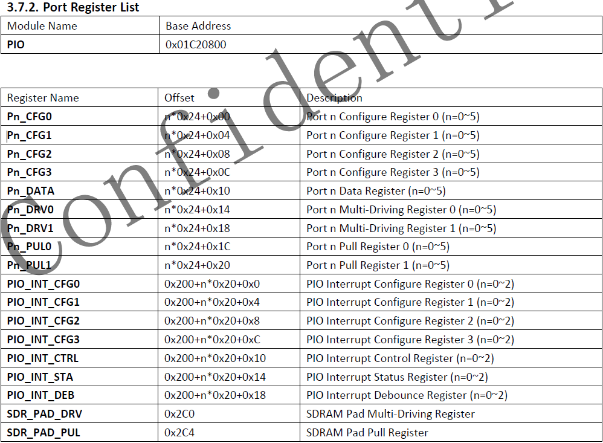

## 目标

​	编写驱动，控制PA0输出高低电平。


## F1C100S硬件接口

> 查找PA0的寄存器






> 通过上面寄存器发现，PA只有PA0-PA3可用作普通IO
>
> 且只需要PA Configure register 0 和 PA Data register 即可控制IO




> GPIO基础地址：0x01c20800
>
> GPIOA基础地址：0*0x24 + 0x01c20800 = 0x01c20800
>
> ​		Pa_CFG0:  0*0x24 + 0 + 0x01c20800 = 0x01c20800
>
> ​		Pa_DATA: 0*0x24 + 0x10 + 0x01c20800 = 0x01c20810


## 字符设备驱动

### 驱动程序

led.c

```
#include <linux/module.h>
#include <linux/kernel.h>
#include <linux/fs.h>
#include <linux/init.h>       
#include <linux/uaccess.h>
#include <asm/io.h>          //含有ioremap函数iounmap函数
#include <asm/uaccess.h>     //含有copy_from_user函数和含有copy_to_user函数
#include <linux/device.h>    //含有类相关的设备函数
#include <linux/cdev.h>

#define GPIOA_CFG0  (0X01C20800)
#define GPIOA_DATA  (0X01C20810)

static dev_t led_dev_num;   //定义一个设备号
static struct cdev * led_dev;   
static struct class * led_class;
static struct device * led0;

size_t * gpioa_cfg0;
size_t * gpioa_data;

static int led_open(struct inode * inode, struct file * file)
{
    /* GPIOA配置 */ 
    *((volatile size_t*)gpioa_cfg0) &= ~(7<<0); //清除配置寄存器 
    *((volatile size_t*)gpioa_cfg0) |= (1<<0); //配置GPIOE10为输出模式 
    printk(KERN_DEBUG"open led!!!\n"); 
    return 0;
}

static int led_close(struct inode *inode, struct file *filp)
{
    printk(KERN_DEBUG"close led!!!\n");
    return 0;
}


static int led_read(struct file *filp, char __user *buff, size_t count, loff_t *offp)
{
    return 0;
}


static int led_write(struct file *filp, const char __user *buff, size_t count, loff_t *offp)
{
    int ret;
    size_t status; 
    ret = copy_from_user(&status,buff,4);     //将用户空间拷贝到内核空间的status
    if(ret < 0)
        printk(KERN_DEBUG"write error!!!\n");   //输出信息
    else
        printk(KERN_DEBUG"write led ok!!!\n");   //输出信息
    *((volatile size_t*)gpioa_data) &= ~(1<<0) ;//清除GPIOE12状态
    if(status == 1)
        *((volatile size_t*)gpioa_data) |= (1<<0);//设置GPIOE12状态1
    return ret;
}

static struct file_operations led_ops = 
{
        .owner = THIS_MODULE,
        .open  = led_open,
        .read  = led_read,
        .write = led_write,
        .release = led_close,
};

static int __init led_init(void)   
{
    int ret;
    led_dev = cdev_alloc();    //动态申请一个设备结构体
    if(led_dev == NULL)
    {
        printk(KERN_WARNING"cdev_alloc failed!\n");
        return -1;
    }
    ret = alloc_chrdev_region(&led_dev_num,0,1,"led");  //动态申请一个设备号
    if(ret !=0)
    {
        printk(KERN_WARNING"alloc_chrdev_region failed!\n");
        return -1;
    }
    led_dev->owner = THIS_MODULE;  //初始化设备管理结构体的owner为THIS_MODULE
    led_dev->ops = &led_ops;        //初始化设备操作函数指针为led_ops函数
    cdev_add(led_dev,led_dev_num,1);  //将设备添加到内核中
    led_class = class_create(THIS_MODULE, "led_class");  //创建一个名为led_class的类  /sys/class
    if(led_class == NULL)
    {
        printk(KERN_WARNING"led_class failed!\n");
        return -1;
    }
    led0 = device_create(led_class,NULL,led_dev_num,NULL,"led_A0");//创建一个设备名为led0 /dev/led0
    if(IS_ERR(led0))
    {
        printk(KERN_WARNING"device_create failed!\n");
        return -1;
    }
    gpioa_cfg0 = ioremap(GPIOA_CFG0,4);  //将GPIOE_CFG0物理地址映射为虚拟地址
    gpioa_data = ioremap(GPIOA_DATA,4);  //将GPIOE_DATA物理地址映射为虚拟地址
    return 0;
}

static void __exit led_exit(void)   
{
    cdev_del(led_dev);  //从内核中删除设备管理结构体
    unregister_chrdev_region(led_dev_num,1);  //注销设备号
    device_destroy(led_class,led_dev_num);   //删除设备节点
    class_destroy(led_class);                //删除设备类
    iounmap(gpioa_cfg0);  //取消GPIOE_CFG0映射
    iounmap(gpioa_data);  //取消GPIOE_DATA映射
}

module_init(led_init);
module_exit(led_exit);

MODULE_LICENSE("GPL");          //不加的话加载会有错误提醒
MODULE_AUTHOR("1477153217@qq.com");     //作者
MODULE_VERSION("0.1");          //版本
MODULE_DESCRIPTION("led_dev");  //简单的描述

```

### makefile

```
KERN_DIR = /home/xsx/licheepi_nano_tf/Linux

all:
	make -C $(KERN_DIR) M=$(shell pwd) modules

clean:
	rm -rf *.order *o *.symvers *.mod.c *.mod *.ko

obj-m += led.o 
```

### 编译

编译驱动要使用 u-boot和linux相同的编译链

` make ARCH=arm CROSS_COMPILE=arm-linux-gnueabi- `

会按照makefile的规则编译出led.ko


## 测试程序

led_app.c

```
#include <sys/types.h>
#include <sys/stat.h>
#include <fcntl.h>
#include <stdio.h>
#include <unistd.h>
#include <string.h>

int main(int argc, char **argv)
{
    int fd;
    char *filename = NULL;
    int val;

    filename = argv[1];
    fd = open(filename, O_RDWR);
    if (fd < 0)
    {
        printf("err, can`t open %s\r\n", filename);
        return 0;
    }

    if (argc != 3)
    {
        printf("usage: ./led_app.exe [device] [on/off]\r\n");
    }

    if (!strcmp(argv[2], "on"))
    {
        val = 0;
    }
    else if (!strcmp(argv[2], "off"))
    {
        val = 1;
    }
    else
    {
        printf("输入错误！\r\n");
        return 0;
    }

    write(fd, &val, 4);
    close(fd);
    return 0;
}
```

### 编译

编译测试程序需要用 buildroot 生成 的交叉编译链

`arm-linux-gcc led_app.c -o led_app.exe`

## 运行

将led.ko 和 led_app.exe拷贝到开发板

### 加载驱动

`insmod led.ko`

出现`loading out-of-tree module taints kernel.`，即表明加载成功

### 运行测试程序

led亮： `./led_app.exe /dev/led_A0 on`

led灭： `./led_app.exe /dev/led_A0 off`

led_A0 为led.c驱动代码中设置的设备名称，驱动加载后，会在/dev/下创建该驱动的文件

