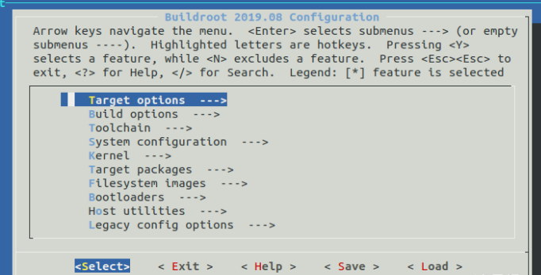
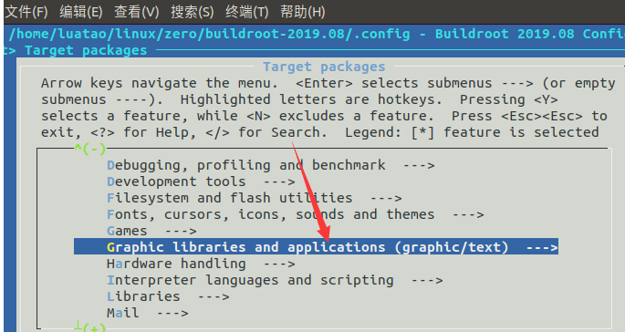
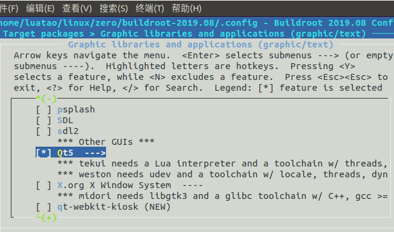
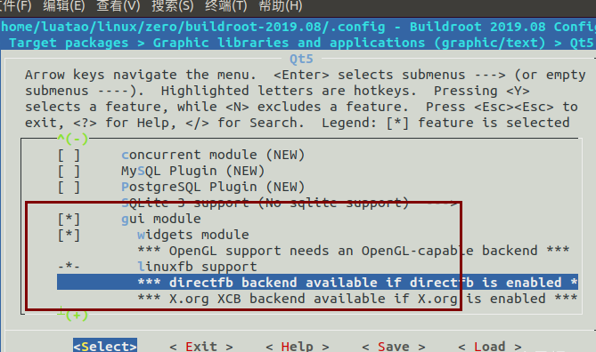
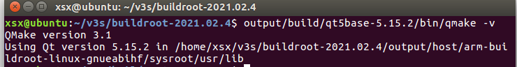
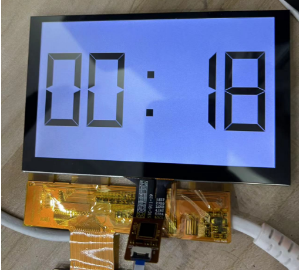

## 一.配置编译
在buildroot下面，打开配置界面
`make menuconfig`





然后编译
`make`

将文件系统解压到第二分区
`tar -xvf output/images/rootfs.tar -C /media/xsx/rootfs/`

## 二.查看QT版本
`output/build/qt5base-5.12.4/bin/qmake -v`

可以看到我们的qt是5.15的

## 三.运行一个demo
例程都在
`output/build/qt5base-5.12.4/examples/widgets/widgets/`
使用qmake 编译数字时钟的例程
```
cd output/build/qt5base-5.15.2/examples/widgets/widgets/digitalclock/
../../../../bin/qmake digitalclock.pro 
xsx@ubuntu:~/v3s/buildroot-2021.02.4/output/build/qt5base-5.15.2/examples/widgets/widgets/
```

查看生成了Makefile
```
digitalclock$ ls
digitalclock.cpp  digitalclock.h  digitalclock.pro  main.cpp  Makefile
```

执行make
```
xsx@ubuntu:~/v3s/buildroot-2021.02.4/output/build/qt5base-5.15.2/examples/widgets/widgets/digitalclock$ make
/home/xsx/v3s/buildroot-2021.02.4/output/host/bin/arm-linux-gnueabihf-g++ --sysroot=/home/xsx/v3s/buildroot-2021.02.4/output/host/arm-buildroot-linux-gnueabihf/sysroot -Wl,-O1 -Wl,--enable-new-dtags -o digitalclock .obj/digitalclock.o .obj/main.o .obj/moc_digitalclock.o   -latomic /home/xsx/v3s/buildroot-2021.02.4/output/build/qt5base-5.15.2/lib/libQt5Widgets.so /home/xsx/v3s/buildroot-2021.02.4/output/build/qt5base-5.15.2/lib/libQt5Gui.so /home/xsx/v3s/buildroot-2021.02.4/output/build/qt5base-5.15.2/lib/libQt5Core.so -lpthread  -lrt -lpthread -ldl 
```

查看，已经生成可执行文件digitalclock
```
xsx@ubuntu:~/v3s/buildroot-2021.02.4/output/build/qt5base-5.15.2/examples/widgets/widgets/digitalclock$ ls
digitalclock      digitalclock.h    main.cpp
digitalclock.cpp  digitalclock.pro  Makefile
```

在sd卡第二分区建立调试文件夹xsx
复制可执行文件digitalclock到此文件夹
将sd卡上电
```
cd /xsx
./digitalclock -platform linuxfb
```
即可看到屏幕显示数字时钟

