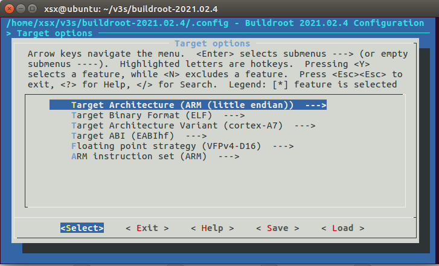
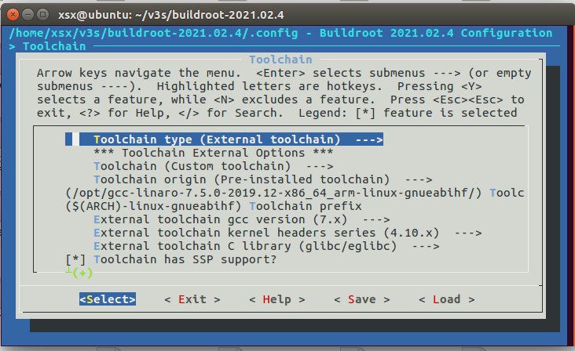

## 交叉编译链工具安装
* 工具下载地址，这里使用7.5版本的交叉编译链，建议迅雷下载
`https://releases.linaro.org/components/toolchain/binaries/7.5-2019.12/arm-linux-gnueabihf/gcc-linaro-7.5.0-2019.12-x86_64_arm-linux-gnueabihf.tar.xz`


* 下载完后，复制到ubuntu中
* 解压
  `tar -vxJf gcc-linaro-7.5.0-2019.12-x86_64_arm-linux-gnueabihf.tar.xz`
* 复制到系统目录
  `sudo cp -r ./gcc-linaro-7.5.0-2019.12-x86_64_arm-linux-gnueabihf /opt/`
* 添加到系统环境变量
    ```
    #打开配置文件
    sudo vim /etc/bash.bashrc
    #在文件最后添加
    PATH="$PATH:/opt/gcc-linaro-7.5.0-2019.12-x86_64_arm-linux-gnueabihf/bin"
    #使文件生效
    source /etc/bash.bashrc
    ```
* 验证生效，重启
    `arm-linux-gnueabihf-gcc -v`

## U盘分区

* 安装gparted工具
  `sudo apt-get install gparted `

* 分区1
  从1M偏移处开始，大小32M，fat16格式

* 分区2
  剩余所有空间，exe4格式

## 编译u-boot
* 下载荔枝派u-boot
  `git clone https://github.com/Lichee-Pi/u-boot.git -b v3s-current`
* 修改 include/configs/sun8i.h, 使u-boot可以直接从tf卡启动
  ```
    #define CONFIG_BOOTCOMMAND   "setenv bootm_boot_mode sec; " \
                            "load mmc 0:1 0x41000000 zImage; "  \
                            "load mmc 0:1 0x41800000 sun8i-v3s-licheepi-zero-dock.dtb; " \
                            "bootz 0x41000000 - 0x41800000;"
    #define CONFIG_BOOTARGS      "console=ttyS0,115200 panic=5 rootwait root=/dev/mmcblk0p2 earlyprintk rw  vt.global_cursor_default=0"
    ```
* 编译
  ```
  make ARCH=arm CROSS_COMPILE=arm-linux-gnueabihf- LicheePi_Zero_800x480LCD_defconfig
  make ARCH=arm CROSS_COMPILE=arm-linux-gnueabihf- -j8
  ```
* 烧录到TF卡
  `sudo dd if=u-boot-sunxi-with-spl.bin of=/dev/sdb bs=1024 seek=8`
* 此时插入TF启动，即可看到u-boot的启动信息

## 编译linux
* 下载linux
  `git clone -b zero-5.2.y --depth 1 https://github.com/Lichee-Pi/linux.git`
* 编译
  ```
  make ARCH=arm licheepi_zero_defconfig
  make ARCH=arm menuconfig
  make ARCH=arm CROSS_COMPILE=arm-linux-gnueabihf- -j8
  ```

* 将`arch/arm/boot/zImage`和`arch/arm/boot/dts/sun8i-v3s-licheepi-zero-dock.dtb`复制到SD卡的第一分区即可

## 编译文件系统
* 下载
  ```
  wget https://buildroot.org/downloads/buildroot-2021.02.4.tar.gz
  tar xvf buildroot-2021.02.4.tar.gz
  cd LicheePi_Nano/buildroot-2021.02.4
  ```
* 使用make menuconfig命令，来配置buildroot
  1. target options
      
  2. 编译链设置，使用外部交叉编译链，即编译u-boot和kernel的编译链，这样的好处是u-boot、kernel、rootfs、app全部都可以使用此编译链
      
      ```
      #设置使用外部交叉编译链
      Toolchain type (External toolchain)  --->
        x   ( ) Buildroot toolchain
        x   (X) External toolchain

      Toolchain (Custom toolchain)
      Toolchain origin (Pre-installed toolchain)
      Toolchain path --->
          /opt/gcc-linaro-7.5.0-2019.12-x86_64_arm-linux-gnueabihf/
      Toolchain prefix --->
          $(ARCH)-linux-gnueabihf 

      ##因为前面安装的是7.5的交叉编译链
      External toolchain gcc version (7.x)

      #编译链使用内核版本，查看路径：arm-linux-gnueabihf/libc/usr/include/linux/version.h
      版本解析：4.6(263680=0x040600, 即4.6.0)
      7.5交叉编译链的内核版本为4.10
      External toolchain kernel headers series (4.10.x)

      External toolchain C library (glibc/eglibc)
      ```
  3. 编译 `make`
  4. 解压到SD卡第二分区
      `tar -xvf output/images/rootfs.tar -C /media/xsx/rootfs/`

## 上电验证
  插上SD卡，上电后，即可看到进入系统