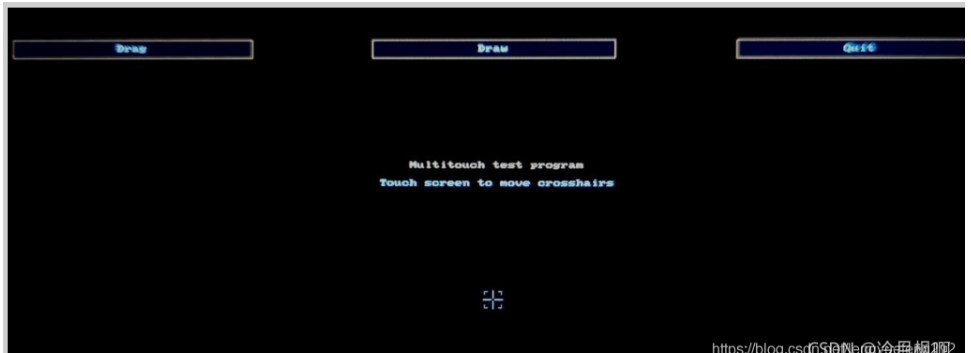

## 一、在linux源码中添加gt911驱动
### 1.1、添加gt911驱动源码
drivers/input/touchscreen/gt911.c
```
#include <linux/module.h>
#include <linux/regmap.h>
#include <linux/gpio/consumer.h>
#include <linux/of_irq.h>
#include <linux/interrupt.h>
#include <linux/input.h>
#include <linux/input/mt.h>
#include <linux/debugfs.h>
#include <linux/delay.h>
#include <linux/slab.h>
#include <linux/gpio.h>
#include <linux/of_gpio.h>
#include <linux/input/mt.h>
#include <linux/input/touchscreen.h>
#include <linux/i2c.h>


/**
 * file name：gt9xx
 * date: 2021-09-01  15:04
 * version：1.0
 * author:luatao
 * describe：gt9xx device drive
 */
#define GT_CTRL_REG 	            0X8040  /* GT9147控制寄存器         */
#define GT_MODSW_REG 	        0X804D  /* GT9147模式切换寄存器        */
#define GT_CFGS_REG 	        0X8047  /* GT9147配置起始地址寄存器    */
#define GT_CHECK_REG 	        0X80FF  /* GT9147校验和寄存器       */
#define GT_PID_REG 		        0X8140  /* GT9147产品ID寄存器       */

#define GT_GSTID_REG 	        0X814E  /* GT9147当前检测到的触摸情况 */
#define GT_TP1_REG 		        0X814F  /* 第一个触摸点数据地址 */
#define GT_TP2_REG 		        0X8157	/* 第二个触摸点数据地址 */
#define GT_TP3_REG 		        0X815F  /* 第三个触摸点数据地址 */
#define GT_TP4_REG 		        0X8167  /* 第四个触摸点数据地址  */
#define GT_TP5_REG 		        0X816F	/* 第五个触摸点数据地址   */
#define MAX_SUPPORT_POINTS      5       /* 最多5点电容触摸 */


/* 设备结构体 自定义 */
struct gt911_dev{
    int irq_pin, reset_pin;   /* 中断和复位IO */
    int irqnum;   /* 中断号 */
  //  void *private_date;  /* 私有数据 */
    struct input_dev *input;  /* input结构体 */
    struct i2c_client *client; /* i2c客户端 */
 };

/* 定义一个设备结构体 */
struct gt911_dev gt911;   /*gt911 设备 */
/*
const unsigned char GT911_CT[]=
{
                                0x5A,0x20,0x03,0xE0,0x01,0x05,0x3D,0x00,0x02,0x08,0x28,
                                0x08,0x5A,0x46,0x03,0x05,0x00,0x00,0x00,0x00,0x00,0x00,
                                0x04,0x04,0x04,0x04,0x03,0x88,0x29,0x0A,0x4B,0x4D,0x0C,
                                0x08,0x00,0x00,0x00,0x21,0x02,0x1D,0x00,0x01,0x00,0x00,
                                0x00,0x00,0x00,0x00,0x00,0x00,0x00,0x46,0x64,0x94,0xD5,
                                0x02,0x07,0x00,0x00,0x04,0x83,0x48,0x00,0x77,0x4D,0x00,
                                0x6D,0x53,0x00,0x64,0x59,0x00,0x5A,0x60,0x00,0x5A,0x00,
                                0x00,0x00,0x00,0x00,0x00,0x00,0x00,0x00,0x00,0x00,0x00,
                                0x00,0x00,0x00,0x00,0x00,0x00,0x00,0x00,0x00,0x00,0x00,
                                0x00,0x00,0x00,0x00,0x00,0x00,0x00,0x00,0x00,0x00,0x00,
                                0x00,0x00,0x02,0x04,0x06,0x08,0x0A,0x0C,0x0E,0x10,0x12,
                                0x14,0xFF,0xFF,0xFF,0xFF,0x00,0x00,0x00,0x00,0x00,0x00,
                                0x00,0x00,0x00,0x00,0x00,0x00,0x00,0x00,0x00,0x00,0x00,
                                0x02,0x04,0x06,0x08,0x0F,0x10,0x12,0x16,0x18,0x1C,0x1D,
                                0x1E,0x1F,0x20,0x21,0x22,0xFF,0xFF,0xFF,0xFF,0xFF,0xFF,
                                0xFF,0xFF,0xFF,0x00,0x00,0x00,0x00,0x00,0x00,0x00,0x00,
                                0x00,0x00,0x00,0x00,0x00,0x00,0x00,0x00,0xD6,0x01,
};*/


/* 从gt911读取多个寄存器数据 
 @param - *dev        : gt911设备 
 @param - reg           : 要读取的寄存器首地址
 @param - *buf         : 读取到的数据 
 @param - len          : 要读取的数据长度 
 @return                    :操作结果
*/
static int gt911_read_regs(struct gt911_dev *dev, u16 reg, u8 *buf, int len)
{
    int ret = 0;
    u8 regdata[2]; // 寄存器数据
    struct i2c_msg msg[2];   /* 传输的消息 读的命令 */
    struct i2c_client *client = (struct i2c_client *)dev->client;  /* 私有数据 */

    /* gt911 寄存器长度为2个字节 */
    regdata[0] = (reg >> 8) & 0xFF;  // 高8位
    regdata[1] = reg & 0xFF;  // 低8位 

    /* msg[0] 为发送要读取的首地址 */
    msg[0].addr = client->addr;  /* 器件地址 */
    msg[0].flags = 0;                       /* 标记为发送数据 */
    msg[0].buf = &regdata[0];              /* 要读取数据的首地址 */
    msg[0].len = 2;                     /* reg长度 */

    /* msg[1]读取数据 */
    msg[1].addr = client->addr;  /* 器件地址 */
    msg[1].flags = I2C_M_RD;    /* 标记为读取数据 */
    msg[1].buf = buf;              /* 读取数据缓冲区  */
    msg[1].len = len;                     /* 读取数据长度 */

    ret = i2c_transfer(client->adapter, msg, 2);  /* 向总线发送2个消息 */
    if(ret == 2){  /* 传输成功 */
        ret = 0;
    }else{
        printk("i2c_transfer failed!\r\n");
        return -EREMOTEIO;
    }

    return ret;
}

/* 从gt911多个寄存器写入数据 
 @param - *dev        : gt911设备 
 @param - reg           : 要写入的寄存器首地址
 @param - *buf         : 写入的数据缓冲区
 @param - len          : 要写入的数据长度 
 @return                    :操作结果
*/
static s32 gt911_write_regs(struct gt911_dev *dev, uint16_t reg, uint8_t *buf, int len)
{
    uint8_t buf1[256];
    struct i2c_msg msg;   /* 传输的消息 */
    struct i2c_client *client = (struct i2c_client *)dev->client;  
    buf1[0] = (reg >> 8) & 0xFF;  /* 寄存器首地址 */
    buf1[1] = reg & 0xFF;  
    memcpy(&buf1[2], buf, len);  /* 要写入的数据拷贝到数据buf1中 */
    
    /* msg处理数据 */
    msg.addr = client->addr;  /* 器件地址 */
    msg.flags = 0;    /* 标记为写入数据 */
    msg.buf = buf1;              /* 要写入的数据缓冲区  */
    msg.len = len + 2;                     /* 写入的数据长度 */

    return  i2c_transfer(client->adapter, &msg, 1);  /* 向总线发送1个消息 */
}


/* 从gt911读取指定寄存器值 读取一个寄存器
 @param - *dev        : ap3216设备 
 @param - reg           : 要读取的寄存器
 @return                    :读取到的寄存器值
*/

//static unsigned char  gt911_read_reg(struct gt911_dev *dev, u8 reg)
//{
  // struct i2c_client *client = (struct i2c_client *)dev->client;  /* 私有数据 */

	//return i2c_smbus_read_byte_data(client, reg);  /* 读取一个字节数据 */
//}

/* 向gt911指定寄存器写入指定的值，写一个寄存器 
 @param - *dev        : ap3216设备 
 @param - reg           : 要写入的寄存器
 @param - data         : 要写入的值 
 @return                    :无
*/
static void gt911_write_reg(struct gt911_dev *dev, uint16_t reg, uint8_t data)
{
    uint8_t buf = 0;
	buf = data;
	gt911_write_regs(dev, reg, &buf, 1);  /* 调用写入多个寄存器的方法 */
}

/* 触摸中断处理函数 */
static irqreturn_t gt911_irq_handler(int irq, void *dev_id)
{
    u8 touch_num = 0, status, havakey ; // 触摸点的数量最大5点触摸  数据是否准备好  是否有按键按下 
    int input_x, input_y, id = 0;  // x，y坐标  触摸ID
    int ret = 0;  // 返回值
    u8 data,touch_data[5];  // 触摸数据
    struct gt911_dev *dev = dev_id; // 触摸设备结构体

    /* 判断是否进入中断 */
    //printk("cd %s\r\n",__FUNCTION__);

    /* 读取坐标点寄存器 */
    ret = gt911_read_regs(dev, GT_GSTID_REG, &data, 1); 
    /* 这一位数据的表示：
       bit7：1表示坐标（或按键）已经准备好，主控可以读取  0 表示未就绪，数据无效
       bit4：1表示有按键 0表示无按键（已经松开）
       bit3~0：屏上的坐标点个数  */
    if(data == 0x00){  /* 没有触摸数据*/
        goto fail;
    }else{  /* 统计触摸信息 */
        status = data >> 7;  // 取最高位 
        havakey = (data >> 4) & 0x01; 
        touch_num = data & 0x0f;  // 只取低4位 
    }

    /* 单点触摸 不适用于多点触摸*/
    if(touch_num){  /* 有触摸按下   */
        gt911_read_regs(dev, GT_TP1_REG, touch_data, 5);  // 读取第一个触摸点 连续读5个数据 
        id = touch_data[0] & 0x0F; 
        if(id == 0){
            input_x = (touch_data[1] | (touch_data[2] << 8)) & 0x0fff;  // x坐标
            input_y = (touch_data[3] | (touch_data[4] << 8)) & 0x0fff;  // y坐标

            input_mt_slot(dev->input, id); // 产生ABS_MT_SLOT 事件 报告是哪个触摸点的坐标 
            input_mt_report_slot_state(dev->input, MT_TOOL_FINGER, true);   // 指定手指触摸  连续触摸
            input_report_abs(dev->input, ABS_MT_POSITION_X, input_x);   // 上报触摸点坐标信息 
            input_report_abs(dev->input, ABS_MT_POSITION_Y, input_y);   // 上报触摸点坐标信息 

            //printk("x = %d, y = %d\r\n", input_x, input_y);  //打印坐标信息 
        }
    }else if(touch_num == 0){  // 单点触摸释放 
        input_mt_slot(dev->input, id); /* 上报触摸点 */
        input_mt_report_slot_state(dev->input, MT_TOOL_FINGER, false); // 关闭手指触摸 
    }

        input_mt_report_pointer_emulation(dev->input, true); 
        input_sync(dev->input);   /* 同步数据 数据上报完成 */

        data = 0x00;  /* 向0x814E寄存器写0  不然就会一直进入中断 */
        gt911_write_regs(dev, GT_GSTID_REG, &data, 1);   //写入

fail:
    return IRQ_HANDLED;
}

/* 申请IO并复位gt911 
 @param - *client           : i2C控制器
 @param - *dev         : 自定义的触摸设备
 @return                    :0：成功             其他负值 ：失败
*/
static int gt911_ts_reset(struct i2c_client * client, struct gt911_dev *dev)
{
    int ret = 0;
    printk("cd %s\r\n",__FUNCTION__);
    /* 申请复位IO */
    if(gpio_is_valid(dev->reset_pin)){  // 判断gpio是否合法
    /* 申请复位 IO  并且默认输出高电平 */
        ret = devm_gpio_request_one(&client->dev,     
                                                                        dev->reset_pin,
                                                                        GPIOF_OUT_INIT_LOW,
                                                                        "gt911 reset");
        if(ret){  // 申请失败
            printk("request reset_pin failed!\r\n");
             return ret;
        }
    }

    /* 申请中断IO*/
     if(gpio_is_valid(dev->irq_pin)){  // 判断gpio是否合法
    /* 申请复位 IO  并且默认输出高电平 */
        ret = devm_gpio_request_one(&client->dev,     
                                                                        dev->irq_pin,   //  引脚编号
                                                                        GPIOF_OUT_INIT_LOW,   // 默认的电平状态 
                                                                        "gt911 irq");  // 名字 随便
        if(ret){  // 申请失败
            printk("request irq_pin failed!\r\n");
             return ret;
        }
    }

    /* 初始化gt911  */
    gpio_set_value(dev->reset_pin, 0); /* 复位 */
    msleep(10);
    gpio_set_value(dev->reset_pin, 1); /* 停止复位 */
    msleep(10);
    gpio_set_value(dev->irq_pin, 0);    /* 拉低INT引脚 */
    msleep(50);
    gpio_direction_input(dev->irq_pin); /* INT引脚设置为输入 */

    /* 有一个地址的判断 */

	return 0;
}

/* gt911 中断初始化 
 @param - *client           : i2C控制器
 @param - *dev         : 自定义的触摸设备
 @return                    :0：成功             其他负值 ：失败
*/
static int gt911_ts_irq(struct i2c_client * client, struct gt911_dev *dev)
{
    int ret = 0; // 返回值

    /* 申请中断  */
    ret = devm_request_threaded_irq(&client->dev,
                                                                            client->irq,
                                                                            NULL,
                                                                            gt911_irq_handler,
                                                                            IRQF_TRIGGER_FALLING | IRQF_ONESHOT,
                                                                            client->name,
                                                                            &gt911);
    if(ret){
        dev_err(&client->dev, "Unable to request touchscreen IRQ.\r\n");
        return ret;
    }

    printk("gt911 handler irq number: %d\r\n", client->irq);  // 打印出中断号
    return 0;
}

/* 发送gt911配置参数 
 @param - *dev           : 自定义的触摸设备
 @param - mode         : 0 :参数不保存到flash  1：参数保存到flash
 @return                    :无
*/
/* 屏幕配置信息  */
/*
void gt911_send_cfg(void)
{
    u8 regdata[186] = {0};
    unsigned int i = 0,ret = 0;
    u8 softVersion = 0;  // 软件版本号 
    u8 gt911_id[6] = {0}; // 产品ID
    u8 irqmode = 0;  // 中断触发方式
    u8 crc = 0;  // 校验和 

    //  读软件版本号 
    gt911_read_regs(&gt911, GT_CFGS_REG, &softVersion,1); 
    printk("soft version:%d\r\n", softVersion);

    // 读取产品ID 
    printk("ID: ");
    gt911_read_regs(&gt911, GT_PID_REG, gt911_id,6); 
    for(i = 0; i< 6;i++)
        printk("%d ", gt911_id[i]);

    printk("\r\n");

    // 读中断触发方式 
    gt911_read_regs(&gt911, GT_MODSW_REG, &irqmode,1); 
    printk("irqmode:%d\r\n", irqmode);

    // 读取184个寄存器 
    gt911_read_regs(&gt911, GT_CFGS_REG, regdata,184); 
    for(i= 0; i < 186; i++){
        printk("%#X ", regdata[i]);
        if(i < 184){
            crc += regdata[i];  // 校验和 
        }
    }
    printk("\r\n");
    crc = (~crc) + 1;
    printk("crc:%d\r\n", crc);

    // 软件复位 
    gt911_write_reg(&gt911, GT_CTRL_REG, 2);

    // 配置186个寄存器 
    // 获取设备树的配置信息 
    ret = of_property_read_u8_array(gt911.client->dev.of_node, "goodix,cfg-group0", regdata, 186);
    if (ret < 0) {
        printk("goodix,cfg-group0 property read failed\r\n");
    } else {
        printk("reg data:\r\n");
        for(i = 0; i < 186; i++){
            printk("%X ", regdata[i]);
        }
        printk("\r\n");
    }

    gt911_write_regs(&gt911, GT_CFGS_REG, regdata, sizeof(regdata));  
    gt911_write_reg(&gt911,GT_CTRL_REG,2);

    msleep(100);
}
*/


/* i2C驱动的probe函数 ，当驱动与设备匹配以后此函数就会执行 */
static int gt911_probe(struct i2c_client *client, const struct i2c_device_id *id)
{
    u8 ret = 0; 
    gt911.client = client; 
    printk("gt911 driver and device has match!\r\n");  // 提示信息 

    /* 1. 获取设备树中的中断和复位引脚 */
    gt911.irq_pin = of_get_named_gpio(client->dev.of_node, "irq-gpio", 0);
	gt911.reset_pin = of_get_named_gpio(client->dev.of_node, "rst-gpio", 0);

    printk("get gpios success!\r\n");

    /* 2. 复位gt911 申请GPIO并复位 */
    ret = gt911_ts_reset(client, &gt911);
    if(ret < 0){
        printk("gt911 reset failed!\r\n");
        goto fail;
    }

    /* 3. 初始化gt911 */
    gt911_write_reg(&gt911, GT_CTRL_REG, 2);  /* 软复位 */
    mdelay(100);
    gt911_write_reg(&gt911, GT_CTRL_REG, 0);  /* 停止软复位 */
    mdelay(100);

    /* 4. input 注册设备*/
    gt911.input  = devm_input_allocate_device(&client->dev);
    if(!gt911.input){
        return -ENOMEM;
    }

    /* 初始化input */
    gt911.input->name = client->name;
    gt911.input->id.bustype = BUS_I2C;
    gt911.input->dev.parent = &client->dev;
    /* 设置input设备需要上报事件类型和按键值*/
    __set_bit(EV_KEY, gt911.input->evbit);
	__set_bit(EV_ABS, gt911.input->evbit);
	__set_bit(BTN_TOUCH, gt911.input->keybit);
    /* 设置input设备 需要上报的绝对坐标 */
    input_set_abs_params(gt911.input, ABS_X, 0, 800, 0, 0);
	input_set_abs_params(gt911.input, ABS_Y, 0, 480, 0, 0);
	input_set_abs_params(gt911.input, ABS_MT_POSITION_X,0, 800, 0, 0);
	input_set_abs_params(gt911.input, ABS_MT_POSITION_Y,0, 480, 0, 0);	     
    /* 初始化多点电容触摸的slots*/
	ret = input_mt_init_slots(gt911.input, MAX_SUPPORT_POINTS, 0);  // 初始化 MT 的输入 slots  触摸点的数量
    if(ret != 0){
        printk("MT init failed!\r\n");
        goto fail;
    }

    /* 注册input */
    ret = input_register_device(gt911.input);
    if(ret){
        printk("input register failed!\r\n");
        goto fail;
    }

    /* 最后初始化中断 */
    ret = gt911_ts_irq(client, &gt911);
    if(ret < 0){
        printk("init irq failed!\r\n");
        goto fail;
    }
    return 0;

fail:
    return ret;
}

/* i2c驱动后的remove函数 */
int gt911_remove(struct i2c_client *client)
{
    /* 释放输入设备 */
    input_unregister_device(gt911.input);

    printk("gt911 drive unregsister ok !\r\n");
    return 0;
}

/* 传统匹配方式ID列表 */
static const struct i2c_device_id gt911_id[] = {
    {"goodix,gt911", 0},
    {}
};
/* 匹配列表 */
static const struct of_device_id gt911_of_match[] = {
    {.compatible = "goodix,gt911"},
    {/* Sentinel */}
};

/* i2c驱动结构体 */
struct i2c_driver gt911_i2c_driver = {
        .driver = {
            .owner = THIS_MODULE,
            .name = "gt911",   /* 驱动名字 用于和设备匹配  适用于没有设备树的情况*/
            .of_match_table =gt911_of_match,  /* 设备树匹配列表 */
        },
        .probe =gt911_probe,
        .remove =gt911_remove,
        .id_table = gt911_id, /* id配置列表 */
};


module_i2c_driver(gt911_i2c_driver);

/* LICENSE 和 AUTHOR 信息*/
MODULE_LICENSE("GPL");
MODULE_AUTHOR("luatao");
```
修改drivers/input/touchscreen/makefile
`obj-y	+= gt911.o`

### 1.2、修改设备树
去掉设备树中其他I2C0的设备节点
```
arch/arm/boot/dts/sun8i-v3s-licheepi-zero.dts
/*
&i2c0 {
	status = "okay";

	ns2009: ns2009@48 {
		compatible = "nsiway,ns2009";
		reg = <0x48>;
		status = "disabled";
	};
};
*/
```

添加gt911节点
```
arch/arm/boot/dts/sun8i-v3s-licheepi-zero-dock.dts
&i2c0 {
	status = "okay";

	gt911: touchscreen@5d {
        compatible = "goodix,gt911";
        reg = <0x5d>;
        interrupt-parent = <&pio>;
        interrupts = <1 3 IRQ_TYPE_EDGE_FALLING>; /* (PB3) */
        pinctrl-names = "default";
        irq-gpio = <&pio 1 3 GPIO_ACTIVE_HIGH>; /* (PB3) */
        rst-gpio = <&pio 1 2 GPIO_ACTIVE_HIGH>; /* RST (PB2) */
		status = "okay";
        /* touchscreen-swapped-x-y */
    };
};
```

### 1.3、编译linux
拷贝zimage和sun8i-v3s-licheepi-zero-dock.dtb到sd卡第一分区

## 二、移植tslib
### 2.1、在buildroot中打开tslib
 在buildroot中打开tslib
```
 make menuconfig
 Target packages —>
        Graphic libraries and applications (graphic/text) —>
            [*] Qt5 —>
                [*] Enable Tslib support
```
### 2.2、编译buildroot
    ```
    make

    #解压文件系统到第二分区
    tar -xvf output/images/rootfs.tar -C /media/xsx/rootfs/
    ```

## 三、目标板上配置环境
### 3.1、添加tslib环境变量
修改/etc/profile
```
vi /etc/profile

export T_ROOT=/usr/tslib4arm                        		#目录
export TSLIB_TSDEVICE=/dev/input/event1                     #触摸屏设备文件
export TSLIB_CALIBFILE=/etc/pointercal                		#指定触摸屏校准文件pintercal的存放位置
export TSLIB_CONFFILE=/etc/ts.conf             				#tslib模块配置文件
export TSLIB_PLUGINDIR=/usr/lib/ts/                			#tslib插件库目录
export TSLIB_CONSOLEDEVICE=/dev/tty
export TSLIB_FBDEVICE=/dev/fb0                        		#framebuffer设备文件
```
使生效
`source /etc/profile`
测试
`ts_test`

发现触摸不准，可校准
`ts_calibrate`
校准之后，可再次测试，发现触摸已准